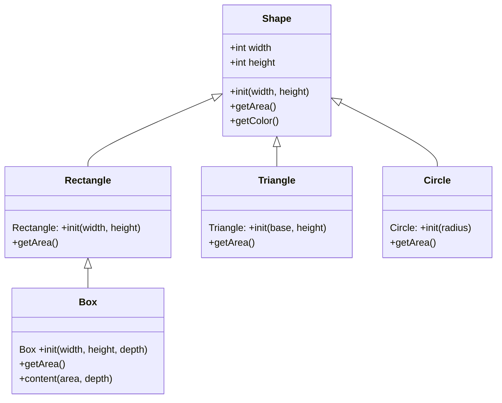

```mermaid
classDiagram
    Shape <|-- Rectangle
    Shape <|-- Triangle
    Shape <|-- Circle
    Rectangle <|-- Box
    Shape: +init(width, height) 
    Shape : +int width
    Shape : +int height
    Shape: +getArea()
    Shape: +getColor()

    class Rectangle {
        Rectangle: +init(width, height)
        +getArea()
    }
    class Triangle {
        Triangle: +init(base, height)
        +getArea()
    }
    class Circle {
        Circle: +init(radius)
        +getArea()
    }
    class Box {
        Box +init(width, height, depth)
        +getArea()
        +content(area, depth)
    }
```            