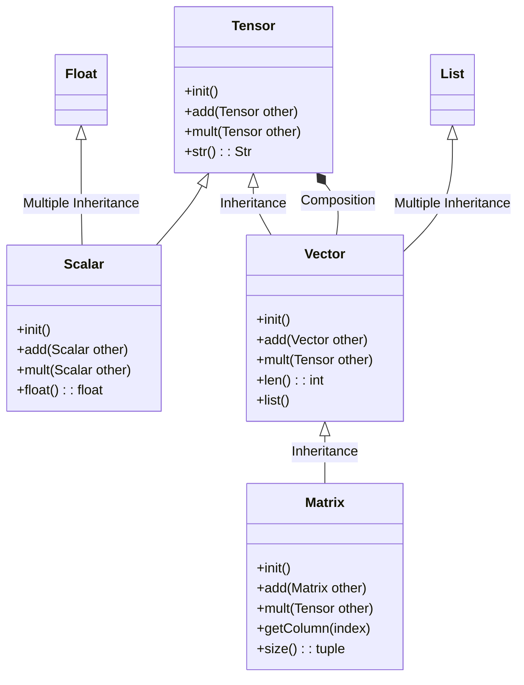

```mermaid
classDiagram
    Tensor <|-- Scalar 
    Tensor <|-- Vector : Inheritance
    Vector --* Tensor : Composition
    Float <|-- Scalar : Multiple Inheritance
    List <|-- Vector : Multiple Inheritance
    Vector <|-- Matrix : Inheritance

    class Tensor {
        +init() 
        +add(Tensor other) 
        +mult(Tensor other)
        +str(): Str
    }

    class Scalar {
        +init()
        +add(Scalar other)
        +mult(Scalar other)
        +float(): float
    }

    class Vector {
        +init()
        +add(Vector other)
        +mult(Tensor other)
        +len(): int
        +list()
    }

    class Matrix {
        +init()
        +add(Matrix other)
        +mult(Tensor other)
        +getColumn(index)
        +size(): tuple
    }
```