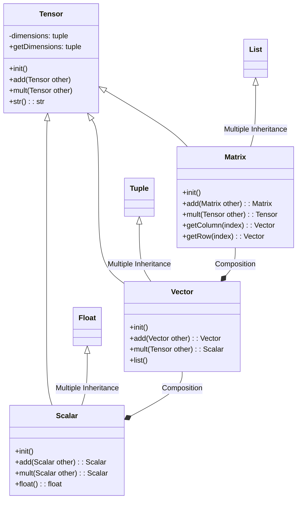

```mermaid
classDiagram
    Tensor <|-- Scalar 
    Tensor <|-- Vector
    Tensor <|-- Matrix
    Float <|-- Scalar : Multiple Inheritance
    Tuple <|-- Vector : Multiple Inheritance
    List <|-- Matrix : Multiple Inheritance
    Vector --* Scalar : Composition
    Matrix --* Vector : Composition 

    class Tensor {
        -dimensions: tuple 
        +init()
        +add(Tensor other) 
        +mult(Tensor other)
        +getDimensions: tuple
        +str(): str
    }

    class Scalar {
        +init()
        +add(Scalar other): Scalar
        +mult(Scalar other): Scalar
        +float(): float
    }

    class Vector {
        +init()
        +add(Vector other): Vector
        +mult(Tensor other): Scalar
        +list()
    }

    class Matrix {
        +init()
        +add(Matrix other): Matrix
        +mult(Tensor other): Tensor
        +getColumn(index): Vector
        +getRow(index): Vector
    }
```