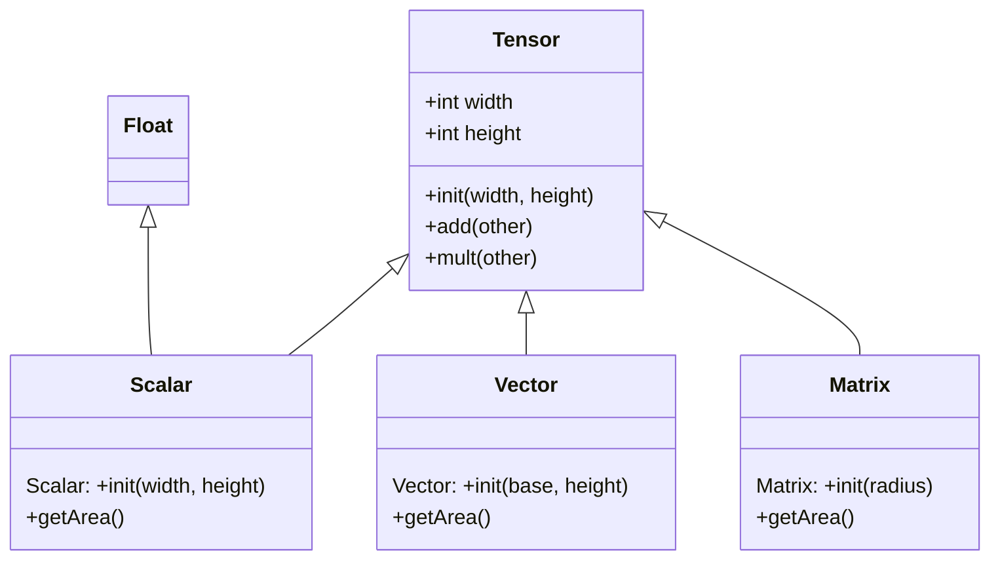

```mermaid
classDiagram
    Tensor <|-- Scalar
    Tensor <|-- Vector
    Tensor <|-- Matrix
    Float <|-- Scalar
    Tensor: +init(width, height) 
    Tensor : +int width
    Tensor : +int height
    Tensor: +add(other)
    Tensor: +mult(other)

    class Scalar {
        Scalar: +init(width, height)
        +getArea()
    }
    class Vector {
        Vector: +init(base, height)
        +getArea()
    }
    class Matrix {
        Matrix: +init(radius)
        +getArea()
    }
    class Float {
    }
```            