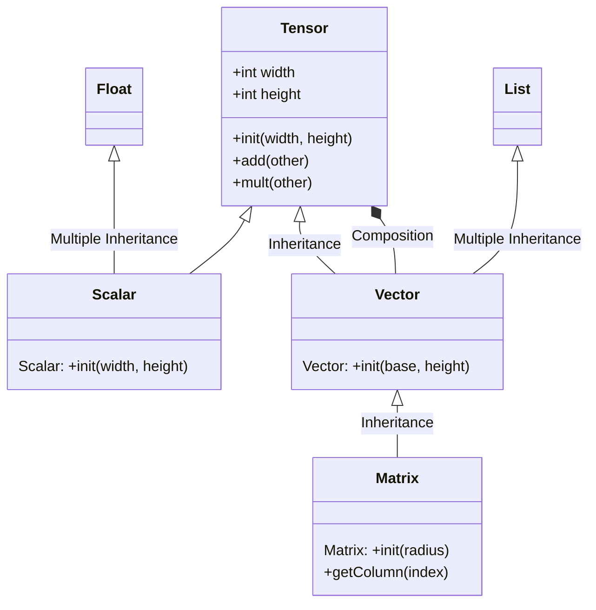

```mermaid
classDiagram
    Tensor <|-- Scalar 
    Tensor <|-- Vector : Inheritance
    Tensor: +init(width, height) 
    Tensor : +int width
    Tensor : +int height
    Tensor: +add(other)
    Tensor: +mult(other)
    Vector --* Tensor : Composition
    Float <|-- Scalar : Multiple Inheritance
    List <|-- Vector : Multiple Inheritance
    Vector <|-- Matrix : Inheritance

    class Scalar {
        Scalar: +init(width, height)
    }
    class Vector {
        Vector: +init(base, height)
    }
    class Matrix {
        Matrix: +init(radius)
        +getColumn(index)
    }
```