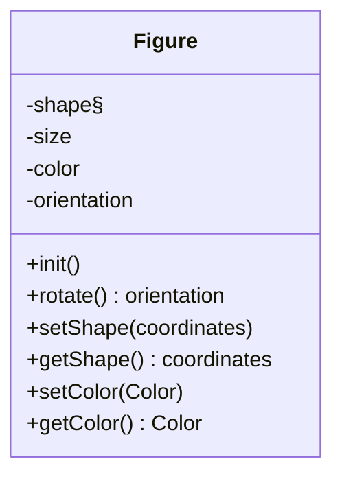
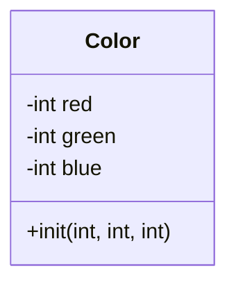

```mermaid
classDiagram
    class Figure:::abstract {
        -shape§
        -size
        -color
        -orientation
        +init()
        +rotate() orientation
        +setShape(coordinates)
        +getShape() coordinates
        +setColor(Color)
        +getColor() Color
        }
```
 

``` mermaid
classDiagram
    class Color{
        -int red
        -int green
        -int blue
        +init(int, int, int)
    }
```