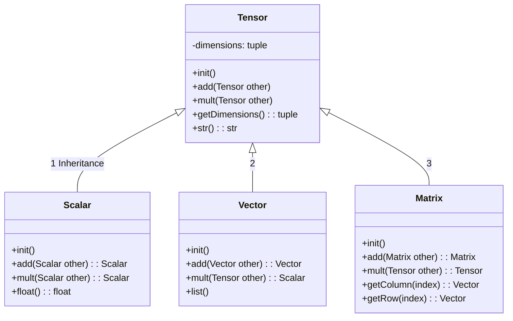

# TINLABML Lineaire Algebra 

## Tensors

**Exercise 1**

Voeg de volgende relaties toe aan onderstaand Class Diagram
<ol>
<li>Scalar <i>is a</i> Tensor</li>
<li>Vector <i>is a</i> Tensor</li>
<li>Matrix <i>is a</i> Tensor</li>
<li>Scalar <i>is a</i> Float</li>
<li>Vector <i>is a</i> Tuple</li>
<li>Matrix <i>is a</i> List</li>
<li>Vector <i>is composed by</i> Scalar</li>
<li>Matrix <i>is composed by</i> Vector</li>
</ol>

<note>

Zie [Mermaid Class diagrams](https://mermaid.js.org/syntax/classDiagram.html) voor de Markdown syntax

</note>

 

**Exercise 2**

<ol>
<li>
Zorg ervoor dat er voor elke method uit tensors.py een unit test is in de test modules.
</li>
<li>
Vul de Classes in module tensors.py aan zodat alle methods geimplementeerd zijn zodanig dat alle unit tests slagen. 
</li>
<li>
Implementeer het vermenigvuldigen van een Scalar met een Vector in Class Scalar.
</li>
<li>
Implementeer het vermenigvuldigen van een Matrix met een Vector in Class Matrix.
</li>
</ol>

