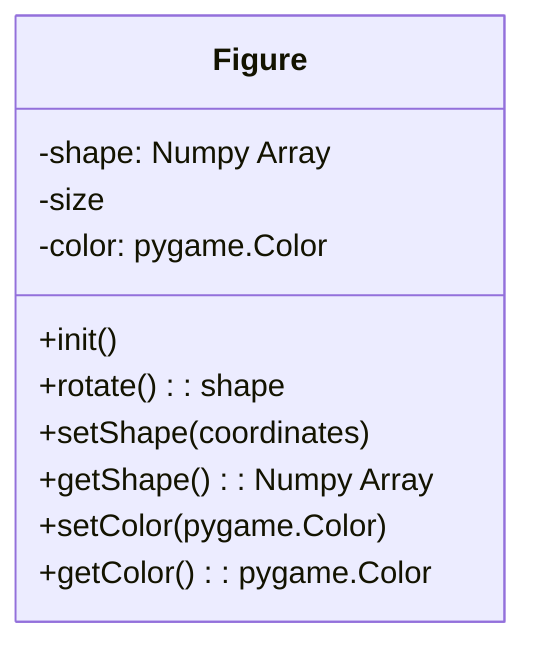

```mermaid
classDiagram
    class Figure:::abstract {
        -shape: Numpy Array
        -size
        -color: pygame.Color    
        +init()
        +rotate(): shape
        +setShape(coordinates)
        +getShape(): Numpy Array
        +setColor(pygame.Color)
        +getColor(): pygame.Color
    }
```