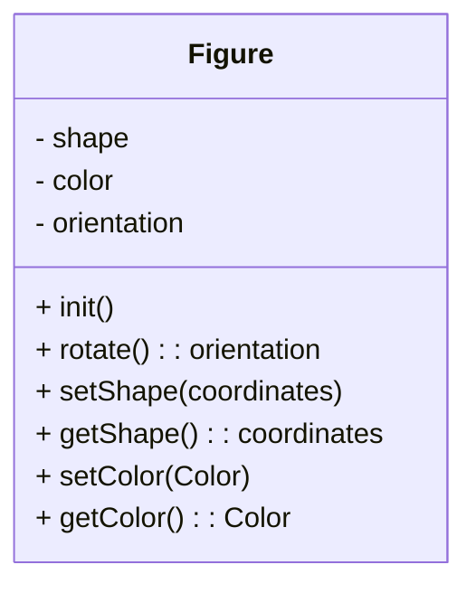
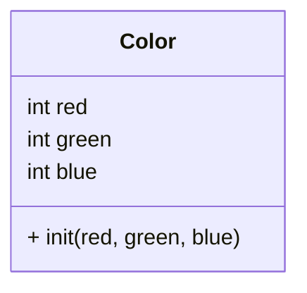
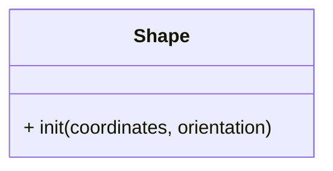

```mermaid
classDiagram
    class Figure {
        - shape
        - color
        - orientation
        + init()        
        + rotate(): orientation
        + setShape(coordinates)
        + getShape(): coordinates
        + setColor(Color)
        + getColor(): Color
    }
```
 

```mermaid
    classDiagram
        class Color {
            int red
            int green
            int blue
            + init(red, green, blue)
        } 
```
 

```mermaid
    classDiagram
        class Shape {
            + init(coordinates, orientation)
        } 

```            